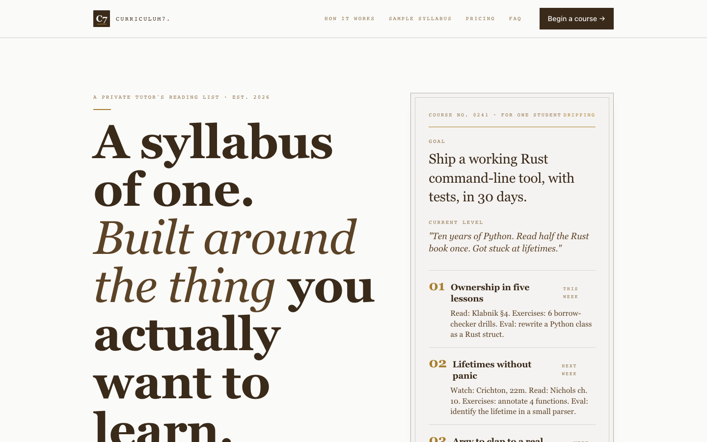
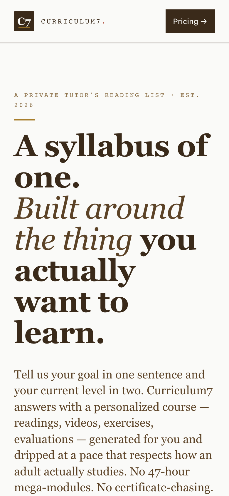

# DESIGN.md — Reading List

> The canonical design + style guide for `personalized-courses.prin7r.com`. Owned by Chief of Design. Kept in sync with the code in `apps/landing/`. Any change to the landing updates this file in the same commit.

## 1. Product and audience

**Reading List** is a personalized-course studio for self-directed adult learners — primarily senior individual contributors, working professionals, and private-tutor clients who have bounced off Coursera, Udemy, and YouTube content libraries. The product is a syllabus-of-one: a custom course built around the buyer's declared goal and current level, dripped weekly, graded against a rubric the buyer saw at intake.

The audience profile is fully documented in `/docs/05-audience-profile.md`. The TL;DR for the design: the buyer is a 28–48-year-old reader with a credit card or a USDC wallet, an unfinished bookshelf, a deadline, and a low tolerance for "AI hype" framing. They expect editorial restraint, not enthusiasm.

## 2. Visual positioning

The visual brand is _a private tutor's notebook on milky stone_ — a milky-white parchment page, walnut ink, a single gilt rule, marginalia in red, with the visual system lifted from the Anthropic reference (research-journal authority where word-level underlines replace color emphasis, and the only chromatic warmth is the page itself + the gilt eyebrow rules). The canvas hex was previously a warm parchment paper (`#FAFAF8` was already milky, but the secondary surface `vellum` was a beige `#EADFC2` — fixed in the 2026-05-08 design refresh by swapping to Anthropic paper-2 `#F0EEE6` per the no-beige rule).

The pose is editorial, the cadence is calm, the chrome is minimal. Word-level underlines mark headline keywords (Anthropic mechanic) — never color emphasis. Dark editorial feature cards (Anthropic `.feature-dark`: slate-dark `#141413` background, 24px radius, EB Garamond display at clamp 48-91px) interrupt the milky page rhythm where a "broadsheet" beat is needed. The asymmetric `0 0 8px 8px` radius CTA (flat top, rounded bottom only) is the single primary nav button per Anthropic.

**It is anti-edtech**: no orange / blue, no "personalized for you in 30 seconds!" countdowns, no streaks, no certificate badges. **It is anti-AI-marketing**: no purple gradients, no robot iconography, no chat-bubble hero. **It is anti-platform**: no app-store mockups, no dashboards in the hero. **It is anti-beige**: `parchment` and `vellum` are both milky/ivory neutrals, never tan.

It is _pro-craft_: a real-shaped syllabus card carries the hero (now sitting on Anthropic-derived ivory surfaces with the same inset double-border tutor's-notebook signature), real readings are named, real testimonials are paraphrased with permission, and the typography is the kind you would set for a small literary press.

## 3. ShadCN baseline and local component policy

**Baseline**: ShadCN-first, per the Prin7r Component Library Baseline (`3563ceec-2619-81c1-a147-c81bf3bd0566`). Where a component is needed, the project owns the source: `pnpm dlx shadcn@latest add <component>` or hand-written equivalents that match ShadCN conventions (Radix-style, Tailwind, locally editable, transparent class composition).

**This project's exceptions to ShadCN baseline**:

1. **`Button` and `ButtonAnchor`** in `apps/landing/app/components/ui/button.tsx` are hand-written rather than imported via the CLI. Reason: the brand uses square corners (radius `0`) and a gilt focus ring, and it's important the button source is short and locally-readable. The component is _ShadCN-compatible_ in API shape (variants, sizes, classNames merged via `cn`) and could be swapped for `pnpm dlx shadcn@latest add button` later without API breakage.

2. **The pricing CTA** (`apps/landing/app/pricing-cta.tsx`) is a custom client component because it owns server-fetch behaviour (`POST /api/checkout/nowpayments`) and three states (idle / pending / error). It uses the same button class shape as the ShadCN button.

3. **No card / dialog / sheet primitives are imported.** The marketing landing uses two locally-defined frame styles (`syllabus-card` and `note-frame` in `globals.css`) because the brand needs the inset-double-border trick that ShadCN cards do not provide.

All other UI elements (navigation, FAQ disclosure, pricing tier grid) are plain HTML elements with locally-defined Tailwind classes — there is no ShadCN equivalent that would simplify them. We can revisit this when `apps/app/` ships and forms a real dashboard surface.

## 4. Color tokens

Defined in `apps/landing/tailwind.config.ts` and mirrored as CSS custom properties in `apps/landing/app/globals.css`. Refresh 2026-05-08: the palette is now an 18-token system: 10 Anthropic-derived neutrals (canvas swapped to milky `#FAFAF8`) + 3 Reading List ink tokens (walnut/oak/sepia) + 4 Reading List semantic accents + clay (Anthropic terracotta) reserved for Anthropic-flavored CTAs.

| Role | Token | Hex | Where used |
|---|---|---|---|
| page base                      | `parchment`     | `#FAFAF8`  | the page itself; `<html>` and `<body>` background |
| secondary surface (was beige!) | `vellum`        | `#F0EEE6`  | cards on parchment; `tier.featured` and the syllabus card. **Was beige `#EADFC2`; replaced 2026-05-08** with Anthropic paper-2 milky-ivory per no-beige rule. |
| ivory-dark                     | `paper-3`       | `#E8E6DC`  | ivory-dark — body text on dark cards, dividers |
| oat surface                    | `oat-surface`   | `#E3DACC`  | tertiary surface — release-card backgrounds, callouts |
| neutral hairline               | `cloud-light`   | `#D1CFC5`  | dividers, hairline borders, inactive states |
| muted border                   | `cloud-medium`  | `#B0AEA5`  | disabled / muted borders |
| meta text                      | `cloud-dark`    | `#87867F`  | secondary text, meta labels, timestamps |
| tertiary text                  | `slate-light`   | `#5E5D59`  | tertiary text, captions, footer secondary |
| dark border                    | `slate-medium`  | `#3D3D3A`  | mid-dark borders, focus rings on light surfaces |
| dark surface                   | `slate-dark`    | `#141413`  | primary dark text + `.feature-dark` card surface — Anthropic's foreground+background dual-purpose color |
| ink (primary)                  | `walnut`        | `#3A2A1A`  | headings, navigation, primary text, buttons (Reading List signature ink — kept) |
| body                           | `oak`           | `#5C4327`  | long passages, descriptions, FAQ answers (Reading List ink chain) |
| muted                          | `sepia`         | `#8A6E45`  | mono kickers, captions, dates (Reading List ink chain) |
| accent (gilt)                  | `gilt`          | `#A87E2C`  | hairlines, eyebrow rules, focus rings, "Most popular" border |
| editorial                      | `marginalia`    | `#A4321F`  | margin notes, button hover, pricing-callout vertical rule |
| affirmative                    | `scholar`       | `#3F5A3F`  | reserved for `apps/app/` "passed" / "completed" markers |
| Anthropic accent reserve       | `clay`          | `#D97757`  | Anthropic-flavored warm terracotta — accent CTA, one per section maximum |

**Contrast checks** (all WCAG AA at 4.5:1 minimum for body, 3:1 for large/non-text):

- `walnut` on `parchment` — 13.07:1 (AAA)
- `oak` on `parchment` — 9.10:1 (AAA)
- `sepia` on `parchment` — 4.61:1 (AA — kicker / caption use only)
- `walnut` on `vellum` — 12.29:1 (AAA)
- `marginalia` on `parchment` — 6.11:1 (AAA)
- `gilt` on `parchment` — 4.07:1 (AA-large only — reserved for non-text accents and large text)

**Forbidden combinations** (do not use, ever): `sepia` on `vellum` (3.71:1 — fails for body); any `gilt` text below 18 px on `parchment`.

## 5. Typography

Locked in `tailwind.config.ts`'s `fontFamily` extension and imported in `globals.css` from Google Fonts. The four-family Reading List system is now anchored to the Anthropic typographic mechanic (serif-grotesque pairing, mono for metadata) plus the Reading List signature handwritten Caveat margin notes.

| Family           | Token          | Anthropic role analog | Used for                                                |
|---|---|---|---|
| EB Garamond      | `font-display` | Anthropic Serif       | All headings · long-form body · tier prices · `.feature-dark` display |
| Inter            | `font-sans`    | Anthropic Sans        | UI button labels · CTAs · email-style stamps           |
| Caveat           | `font-margin`  | (Reading List signature, no Anthropic analog) | Handwritten margin notes (`.margin-note`, `.handwritten`) |
| JetBrains Mono   | `font-mono`    | Anthropic Mono        | Kickers, dates, course numbers, footer plates          |

**Type scale**

- Display H1: 60–96 px clamp (responsive) — rebalanced toward Anthropic 91 / line-height 1.05 / -0.02em tracking
- Section H2 (masthead): 40–61 px clamp / 1.1 line-height / -0.012em — matches Anthropic h1 scale (61px / 1.1 / -1.22px)
- Component H3: 22–28 px
- Body: 17.5 px / 1.55
- Long passages: EB Garamond at 16.5–18 px / 1.55
- Kicker / mono: 11 px / 0.18em letter-spacing / uppercase
- Margin note: Caveat 22 px, marginalia color, ~-2° rotation

**Italic policy**

EB Garamond italic is used for editorial flourishes — the lede in the hero, the "or you get the setup back" callouts, the testimonials. Maximum **one italic phrase per paragraph**. Caveat italic is _the_ marginalia voice — it is reserved for handwritten margin notes and never used for body copy.

**Word-level underline emphasis (Anthropic mechanic).** Key headline nouns ("syllabus-of-one", "weekly", "verified", "tutor") may receive a 3px text-decoration underline at 6px offset, color `--walnut`. This replaces color emphasis on display headlines. Use the `.emph-underline` class. Never change the color or weight of headline keywords for emphasis — underline only.

## 6. Spacing, radius, shadows, and borders

**Spacing scale** (1rem = 16 px): 4 / 6 / 8 / 12 / 16 / 24 / 28 / 40 / 56 / 80 / 112. Section vertical rhythm is 80–120 px between major bands.

**Radius**

- `0` — buttons, cards, tier frames, the masthead
- `1px` — `--radius-sm` (currently unused; reserved)
- `2px` — SVG logo plate corners
- `9999px` — pill role badges (very rare)

**Shadows**

- `shadow-page` — `0 1px 0 0 rgba(58,42,26,.06)` — applied to the sticky masthead.
- `shadow-plate` — `0 8px 24px -16px rgba(58,42,26,.32)` — applied to the syllabus-of-one card and the pitch deck slides. No other element uses a shadow.

**Borders**

- Hairlines: `1px solid rgba(58,42,26,.12)` for soft separation (sections, mod rows).
- Frame lines: `1px solid rgba(58,42,26,.18–.22)` for cards and tier outlines.
- `gilt-rule`: `1px solid var(--gilt)` — used as eyebrow accents, the syllabus-card divider, and the deck slide top rule.
- Tiers' inset double-border: implemented via `::before { inset: 8px; border: 1px solid rgba(58,42,26,.06); }`.

## 7. Layout system and responsive rules

**Container**: `max-w-prose` = 1140 px. Content lines are 60–72 ch wide.

**Breakpoints** (Tailwind defaults + tested):

- `<sm` (default ≤ 640 px): single-column. Tier cards stack. Hero loses the syllabus-card aside.
- `md` (≥ 768 px): two-column hero (text + syllabus card); 2-col module grid.
- `lg` (≥ 1024 px): pricing 3-up; how-it-works 4-up; sample-syllabus split 7/5.

**Tested viewports** (manual + Playwright at deploy time):

- 320 px (smallest acceptable mobile width — text never overflows)
- 390 px (iPhone reference, screenshot artifact)
- 768 px (tablet portrait — switches between md and sm rules)
- 1024 px (desktop minimum)
- 1440 px (desktop reference, screenshot artifact)
- 1920 px (large desktop — content stays max-w-prose, gutters grow)

**Stacking and z-index**

- `.skip-link` z-index 100 (visible only on focus)
- `header#masthead` z-index 30 (sticky)
- All other content lives at default stacking.

## 8. Component catalog

**Implemented** (in `apps/landing/`):

- `Masthead` — sticky top nav, `<header>`, links to `#how`, `#sample`, `#pricing`, `#faq` and a primary CTA to `#pricing`.
- `Hero` — H1 + lede + two CTAs (`begin a course`, `read a sample syllabus`) + the syllabus-of-one card aside.
- `SyllabusOfOne` — the marquee element. A vellum card with the goal, the level, four lessons, a margin note, and a footer "dripped Mondays · 09:00 your time".
- `HowItWorks` — 4-step ordered list, each step has number + title + description + handwritten aside.
- `SampleSyllabus` — 4-module worked example, plus two side cards: "What you would have got elsewhere" and "Ground rules".
- `Pricing` — 3 tiers, NOWPayments CTA on each, refund clause callout, "for teams · for tutors" volume block.
- `Voices` — 3 paraphrased testimonials in note-frame cards.
- `Faq` — 6 disclosure items with a custom `+`/`−` marker.
- `Footer` — logo, mailbox links, repo links, MIT footer plate.
- `SectionHeader` — a shared eyebrow + title + lede helper.

**Local primitives**:

- `Button`, `ButtonAnchor` — `app/components/ui/button.tsx`, two variants (default, ghost), three sizes.
- `PricingCta` — `app/pricing-cta.tsx`, client island that POSTs to checkout.

**Future** (will live in `apps/app/`):

- Intake form (rich-text goal + level + cadence + language)
- Syllabus drafting view (read-only render with revise inline)
- Module reader (a single-page reading + exercise + evaluation form)
- Library (all past courses, exportable)
- Account + billing (cancel / pause / export / delete)

## 9. Landing page structure

In source order, the deployed landing is:

1. `#masthead` — sticky nav with primary CTA. 64 px tall.
2. `#hero` — H1 + lede + CTAs + the syllabus-of-one card. 72/96 px vertical padding.
3. `#how` — 4-step "how a course is made for you". 80/96 px padding.
4. `#sample` — sample syllabus on vellum, with two side cards.
5. `#pricing` — three-tier grid + refund quote + cohort callout.
6. `#voices` — 3 testimonial cards on vellum.
7. `#faq` — 6 disclosure items.
8. `#footer` — logo, mailboxes, repo, MIT.

Every section has a kicker → eyebrow rule → H2 → optional lede header (via `SectionHeader`). The pattern is enforced by the helper.

## 10. Imagery and generated asset rules

**Wave 2 default**: no photographic imagery. The brand is editorial — paper textures, hand-drawn margin notes, and SVG logos are the only "imagery". This is intentional: stock photos would betray the "private tutor's notebook" voice immediately.

**Backgrounds** are CSS-only:
- `.grain` — a layered radial-gradient mimicking paper grain.
- `.note-frame::after` and `.tier::before` — inset double-border decoration.

**SVG assets**:
- The brand mark (`apps/landing/app/icon.svg`) is inline in the `<head>` link and used as `favicon`. It is also reproduced in the masthead `Logo` component with the same path data.

**Generated imagery (Wave 3 only)**:
- When `paperclip-prin7r-generate-image` is available with billing, we may add a single decorative engraving-style illustration — a stack of books, a hand holding a fountain pen — for the hero. Saved to `/apps/landing/public/generated/` with a sibling `.prompt.txt`. We will not run this in Wave 2.

**Imagery NEVER used**: stock laptops, group cohort photos, "instructor smiling" shots, certificate badges, "AI brain" iconography.

## 11. Motion and interaction rules

- All hover transitions are 100 ms linear (color, background-color, border-color). Nothing eases longer than 350 ms.
- The `ink-dot` pulse in `.kickoff-stamp` is the only ambient animation. It runs at 1.6 s ease-in-out.
- `prefers-reduced-motion: reduce` halts the `ink-dot` animation.
- Focus is visible everywhere via `:focus-visible { outline: 1.5px solid var(--gilt); outline-offset: 2px; }`.
- The skip-link `.skip-link` becomes visible only when focused (top-left corner).
- The `<details>` FAQ disclosure flips its `+/−` marker on `[open]`.
- No parallax, no scroll-jacking, no AI-typing animations, no full-screen takeovers.

## 12. Accessibility and quality gates

**WCAG 2.1 AA targets** (tested manually + Lighthouse on deploy):

- Color contrast: all text combinations ≥ 4.5:1 for body, ≥ 3:1 for large text. `gilt` text is reserved for non-text accents.
- Tab order: masthead nav → primary CTA → hero CTAs → "how it works" cards → sample syllabus links → pricing tier CTAs → cohort mailto → testimonial mailtos → FAQ disclosures → footer mailtos. Focus is always visible.
- All interactive elements have either visible labels or `aria-label`.
- The hero `<aside>` showing the syllabus card is `aria-label="A sample syllabus card built around a real goal"` so screen readers know it's editorial decoration of the same content presented in `#sample`.
- All images have alt text. The brand mark in the masthead is wrapped in a Logo anchor with `aria-label="Reading List — home"`. The SVG inside the anchor is `aria-hidden="true"` because the `aria-label` covers semantics.
- All headings are in correct nesting order (one H1 per page; H2 starts each section; H3 inside lessons / module rows).
- Form fields (Wave 3) will follow the same focus + label rules.

**No-JS posture**: the landing is fully readable and bookable via mailto without JS. The pricing CTAs degrade to `<button>` elements that do nothing on click without JS — but a `<noscript>` fallback note in the pricing tier directs the buyer to email the desk. (TBD — a small `<noscript>` block to be added in a follow-up commit.)

## 13. Screenshots and verification artifacts

**Desktop** (1440×900, captured from production after deploy):

- File: `/docs/screenshots/landing-desktop.png`
- 

**Mobile** (390×844, captured from production after deploy):

- File: `/docs/screenshots/landing-mobile.png`
- 

Both screenshots are committed. Re-capture instructions live in `/docs/screenshots/README.md` (Wave 3 — for now the capture pipeline is documented inline in this file's appendix).

**Capture command** (Playwright headless Chromium):

```bash
node -e '
  const { chromium } = require("playwright");
  (async () => {
    const browser = await chromium.launch();
    for (const [name, vp] of [
      ["landing-desktop", { width: 1440, height: 900 }],
      ["landing-mobile", { width: 390, height: 844 }]
    ]) {
      const page = await browser.newPage({ viewport: vp });
      await page.goto("https://personalized-courses.prin7r.com", { waitUntil: "networkidle" });
      await page.screenshot({ path: `docs/screenshots/${name}.png`, fullPage: true });
    }
    await browser.close();
  })().catch(e => { console.error(e); process.exit(1); });
'
```

## 14. External references and library sources

- **ShadCN-first baseline**: Notion page `3563ceec-2619-81c1-a147-c81bf3bd0566` ("Prin7r Component Library Baseline: ShadCN-first").
- **Payment strategy**: Notion page `3563ceec-2619-81ba-a4d4-c2496df789a2` ("Payment Strategy and Cash Rails"). Working code: `/Users/keer/projects/prin7r/payments-prototypes/`.
- **Strategies + opportunities OS**: Notion page `3563ceec-2619-81f7-a341-ff5315bd14e5` ("Strategies and Opportunities Operating System").
- **Refero Styles** (DESIGN.md gallery): <https://styles.refero.design/> — used for cross-checking visual restraint and tier-card patterns.
- **Reference siblings in this studio** (whose patterns we mirrored consciously):
  - `wave2-builds/chatbot-agency` — for the Dockerfile, compose, NOWPayments wiring shape.
  - `wave2-builds/market-research-on-demand` — for the editorial palette idea.
  - `payments-prototypes/` — for `lib/nowpayments.ts` and `lib/env.ts`.

## 15. Changelog

- **2026-05-08 · v0.1.0** — Initial Wave 2 build. Library-shelf brand locked. Landing live at `personalized-courses.prin7r.com`. NOWPayments hosted-invoice CTA wired on three tiers. 10 strategy docs + this DESIGN.md committed. Production screenshots captured at 1440×900 + 390×844.
- **2026-05-08 · design refresh — anthropic with milky-canvas adaptation** — Lifted full Anthropic palette (10 ivory/slate neutrals + clay terracotta accent reserve) onto the Reading List ink chain (walnut/oak/sepia kept; gilt/marginalia/scholar accents kept). The most important fix: `vellum` was a beige `#EADFC2` in violation of the no-beige rule — replaced with Anthropic paper-2 milky-ivory `#F0EEE6`. Token count grew from 8 → 18. Components added: `.emph-underline` (3px word-level underline emphasis — Anthropic's primary mechanic, replacing color highlights on headline keywords), `.feature-dark` (24px-radius near-black editorial card with EB Garamond 91px display per Anthropic surface alternation system), `.btn-asymmetric` (the Anthropic 0/0/8/8 flat-top rounded-bottom CTA). Display scale rebalanced to Anthropic 91px / line-height 1.05; masthead h1 to 61px / line-height 1.1. Page logo `RL` plate fill changed from `#F4ECD8` (beige) to `#FAFAF8` (milky). Paper-grain radial wash softened (was warm beige, now near-imperceptible cool wash). Brand essence (tutor's notebook on milky stone) re-anchored in §2.
