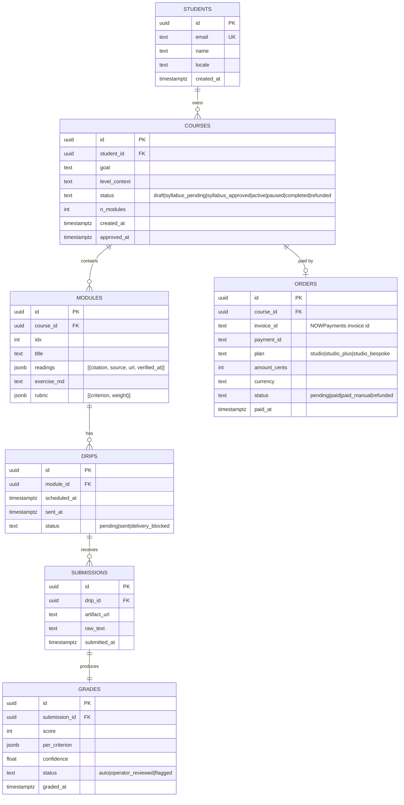

# 12 · Technical specification

> Curriculum7 = Wave 2 landing (NOWPayments + intake hand-off) + Wave 3 SaaS (Wasp / Open-SaaS,
> Postgres, drip + grade workers). Doc 02 is the runtime sketch; this doc is the implementer's
> contract.

## 1. Architecture overview

```mermaid
flowchart LR
  subgraph Edge[storage-contabo · Traefik]
    Tr[Traefik · Lets Encrypt]
  end
  subgraph Landing["apps/landing · Wave 2 · Next.js 15"]
    L[Public site]
    CK[/api/checkout/nowpayments]
    WH[/api/webhooks/nowpayments]
  end
  subgraph App["apps/app · Wave 3 · Wasp / Open-SaaS"]
    AUTH[Auth · email + magic link]
    INTAKE[Intake form]
    OP[Operator queue]
  end
  subgraph Workers["worker · Wave 3"]
    SYL[Syllabus worker]
    VER[Citation verifier]
    DRIP[Drip cron]
    GRD[Grader]
  end
  subgraph Data
    PG[(Postgres 16)]
    OBJ[(S3-compat · Backblaze B2)]
    LOG[(Loki / SQLite audit)]
  end
  subgraph Ext[3rd-party]
    NP[NOWPayments]
    PM[Postmark]
    CR[Crossref]
    OL[OpenLibrary]
    GH[GitHub raw]
    LLM[Claude 4.7 + GLM 5.1]
  end

  Tr --> L
  L --> CK --> NP
  NP --> WH
  L --> AUTH
  AUTH --> INTAKE --> SYL --> LLM
  SYL --> VER --> CR
  VER --> OL
  VER --> GH
  SYL --> PG
  DRIP --> PG
  DRIP --> PM
  GRD --> LLM
  GRD --> PG
  INTAKE --> OBJ
  OP --> PG
```

**Runtime topology:**

- `apps/landing` runs as a Docker container on storage-contabo (host-network Traefik, port 3000
  exposed). Standalone Next.js build.
- `apps/app` (Wave 3) will run on the same host with a separate compose project. Wasp dev → Wasp
  build → Docker.
- Workers run as Bun processes inside the `apps/app` compose, each with their own restart policy.
- Postgres and Backblaze B2 are external; secrets in `.env`.

**Ports:** landing on 3000, app on 3100, workers on the same network as app.

## 2. Data model



Indexes: `students.email` UNIQUE, `(orders.invoice_id, orders.payment_id)` UNIQUE,
`drips.scheduled_at` BTREE, `drips.status` BTREE.

## 3. API contracts

### Wave 2 (landing)

| Method | Path | Auth | Request | Response | Errors |
|---|---|---|---|---|---|
| POST | `/api/checkout/nowpayments` | none | `{plan: "studio"\|"studio_plus"\|"studio_bespoke"}` | `{invoice_url, invoice_id}` 200 | 400 invalid plan, 503 missing_env, 502 nowpayments_5xx |
| POST | `/api/webhooks/nowpayments` | HMAC SHA-512 (`x-nowpayments-sig`) | NOWPayments IPN body | `{ok: true}` 200 | 401 bad_signature, 409 replay (idempotent ok) |
| GET | `/api/healthz` | none | — | `{status: "ok", version}` | — |

### Wave 3 (app)

| Method | Path | Auth | Request | Response |
|---|---|---|---|---|
| POST | `/api/intake` | session | `{course_id, goal, level_context, locale}` | `{course_id, status: "syllabus_pending"}` |
| POST | `/api/courses/:id/approve` | session(student) | `{}` | `{status: "syllabus_approved"}` |
| POST | `/api/courses/:id/pause` | session(student) | `{days: int}` | `{paused_until}` |
| POST | `/api/submissions` | session(student) | multipart (file) + `{drip_id}` | `{submission_id}` |
| GET | `/api/operator/queue` | session(operator) | — | `[{course_id, deadline, flag}]` |
| POST | `/api/operator/syllabi/:id/approve` | session(operator) | `{}` | `{approved_at}` |

### NOWPayments IPN body fields (verified)

`payment_id`, `payment_status` (`waiting|confirming|confirmed|sending|partially_paid|finished|failed|refunded|expired`),
`pay_address`, `price_amount`, `price_currency`, `pay_amount`, `actually_paid`, `pay_currency`,
`order_id`, `order_description`, `purchase_id`, `outcome_amount`, `outcome_currency`.

Webhook is idempotent on `(payment_id, payment_status)`.

## 4. Integrations

| Integration | Auth | Rate limits | Fallback |
|---|---|---|---|
| NOWPayments | `x-api-key` header; HMAC-SHA512 IPN secret | 100 req/min; backoff on 429 | Manual invoice via studio operator |
| Postmark | server token | 300/sec burst, 10k/day | Resend → operator alert after 3 retries |
| Crossref REST | none (mailto polite) | 50/sec polite pool | OpenLibrary as secondary; operator review red flag |
| OpenLibrary | none | 100/sec | GitHub raw README check; operator review |
| GitHub raw | optional token | 60/h unauth, 5000/h auth | Operator review |
| Anthropic (Claude 4.7) | API key | tier-1 60 RPM | GLM 5.1 fallback (cost) |
| Z.AI / GLM 5.1 | API key | tier-1 RPM | Claude 4.7 fallback (quality) |
| Backblaze B2 | application key | 1000 ops/sec | none — single source of truth for submissions |

All keys live in `apps/landing/.env` and `apps/app/.env` on storage-contabo. Never committed; the
`.env.example` files document required keys without values.

## 5. Storage

- **Default:** Postgres 16 (single VPS, weekly Backblaze B2 dump). MVP fits in <2GB / first 200
  students.
- **Migration path:** when concurrent active courses > 500, move Postgres to a managed instance
  (Neon or Supabase). Drizzle schema migrations are reversible.
- **Submissions** (essays, code, audio): Backblaze B2 bucket `prin7r-rl-submissions` with one
  prefix per `course_id`. Lifecycle: 24-month retention then archive to cold tier.
- **Audit log:** SQLite locally (operator actions, refunds) with daily Backblaze B2 export. Append-only.
- **Retention.** Student submissions: 24 months. PII: deleted on refund + 90 days. Logs: 90 days.

## 6. Auth

- **Wave 2 (landing):** no auth. Anonymous checkout. Intake link is a one-time signed token (HMAC
  + 7-day expiry) emailed after IPN confirms `payment_status = finished`.
- **Wave 3 (app):** Wasp's email + magic-link auth. Sessions are 30-day rolling cookies. Studio
  operator role is granted by an `is_operator` flag on `users`.
- **No password.** Magic links and 1-time intake tokens. PASETO v4 for tokens; rotated quarterly.

## 7. Security

- **Secrets:** `.env` only; `direnv` on operator workstations; rotated on staff change. No secrets
  in repo, no secrets in logs (we redact `key`/`token`/`secret` keys).
- **CSRF/CORS:** Wave 2 has no auth, so CSRF is irrelevant for the public site. The IPN endpoint is
  HMAC-protected and accepts any origin. Wave 3 enforces same-origin + CSRF tokens on mutating
  endpoints.
- **Rate limits per endpoint:**
  - `POST /api/checkout/nowpayments` — 30/IP/hour, 200/day total.
  - `POST /api/webhooks/nowpayments` — uncapped (HMAC-protected); 1000/min global circuit breaker.
  - `POST /api/intake` — 5/IP/min.
  - `POST /api/submissions` — 30/IP/hour.
- **PII handling:** student email + name only. Goal/level_context may contain employer names;
  treated as confidential. Never used in marketing.
- **Audit log triggers:** every refund, every operator override of grade, every syllabus
  replacement reading, every course pause/resume.

## 8. Observability

- **Logs:** structured JSON via Pino on the landing; Wasp's logger on the app. All shipped to a
  Loki instance on storage-contabo (Wave 3); Wave 2 ships to stderr → docker → journald.
- **Metrics emitted (Wave 3):**
  - `rl.syllabus.duration_ms` histogram
  - `rl.drip.delivery_status` counter
  - `rl.grade.confidence` histogram
  - `rl.payments.invoice_to_paid_ms` histogram
  - `rl.operator.queue_depth` gauge
- **Trace propagation:** `traceparent` header from landing → app → workers; OTel-compatible.
- **Alert thresholds:**
  - `rl.operator.queue_depth > 5 for 1h` → operator pager
  - `rl.drip.delivery_status{status=blocked} > 0 for 1h` → operator pager
  - `rl.payments.invoice_to_paid_ms{p95} > 25min` → ops alert

## 9. Performance budgets

| Path | p50 | p95 | p99 |
|---|---|---|---|
| `/` first paint (cached) | 350ms | 800ms | 1.5s |
| `/` LCP | 1.2s | 2.0s | 3.0s |
| `POST /api/checkout/nowpayments` round-trip | 700ms | 1.5s | 3.5s |
| IPN HMAC verify | 5ms | 12ms | 25ms |
| Syllabus draft (LLM) | 18s | 40s | 90s (queue) |
| Drip email Postmark | 200ms | 600ms | 2s |
| Grade pass (LLM) | 12s | 30s | 60s |

Concurrency target: 50 simultaneous active courses on one VPS, 500 with managed Postgres.
Throughput target: 200 IPN events/min sustainable.

## 10. Non-goals (explicit)

- Live chat tutor inside drip emails.
- A mobile app. Mobile web is supported; native is not.
- Marketplace of third-party authors.
- Streaks / gamification.
- Cohort scheduling.
- "AI-generated certificate" of any kind.
- Crypto payments outside NOWPayments (no native Stripe rail in Wave 2; manual Wise invoice is the
  only fallback for buyers without crypto).
- White-labeling for resellers (Wave 4 candidate, not committed).
